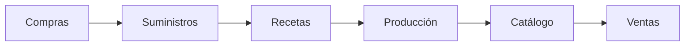

# Manual de Usuario - Focaccia Plus & Coffee ERP

**Sistema de Gestión Empresarial Integral**  
Versión 2.0 | Enero 2026

---

## Tabla de Contenidos

1. [Introducción al Sistema](#introducción)
2. [Módulo: Tasas de Cambio](#tasas)
3. [Módulo: Suministros](#suministros)
4. [Módulo: Recetas](#recetas)
5. [Módulo: Producción](#producción)
6. [Módulo: Catálogo de Productos](#catálogo)
7. [Módulo: Config (Estructura de Productos)](#config)
8. [Módulo: Ventas](#ventas)
9. [Módulo: Compras](#compras)
10. [Módulo: Pérdidas/Mermas](#mermas)
11. [Módulo: Reportes](#reportes)
12. [Módulo: Administración](#administración)
13. [Flujos de Trabajo Completos](#flujos)

---

## 1. Introducción al Sistema {#introducción}

El ERP de Focaccia Plus & Coffee es un sistema completo de gestión que integra:
- **Inventario de insumos** con conversión automática de unidades
- **Recetas profesionales** con fórmulas panaderas (%)
- **Producción atómica** con deducción automática de ingredientes
- **Catálogo dinámico** con cálculo de márgenes en tiempo real
- **Ventas multimoneda** con actualización en vivo
- **Reportes ejecutivos** con gráficas y KPIs

### Roles del Sistema

| Rol | Permisos |
|-----|----------|
| **Director** | Acceso total a todos los módulos |
| **Gerente** | Producción, Ventas, Compras, Recetas, Catálogo, Reportes |
| **Asistente** | Ventas, Catálogo (solo lectura en costos) |

---

## 2. Módulo: Tasas de Cambio {#tasas}

> **Acceso**: Solo Director  
> **Icono**: 🪙 Tasas

### Propósito
Gestionar las tasas de cambio del BCV (Banco Central de Venezuela) para conversión automática de precios en USD, EUR y VES.

### Funcionalidades

#### Actualizar Tasas
1. Ingresa al módulo **🪙 Tasas**
2. Verás las tasas actuales en pantalla
3. Haz clic en **"Actualizar Tasas"**
4. Ingresa:
   - **USD → VES**: Tasa del dólar (ej: 36.50)
   - **EUR → VES**: Tasa del euro (ej: 40.20)
5. Haz clic en **"Guardar"**

> [!IMPORTANT]
> Las tasas se aplican automáticamente a TODO el sistema. Actualízalas diariamente para precios precisos.

### Impacto en el Sistema
- **Catálogo**: Los precios en Bs. se recalculan automáticamente
- **Ventas**: Las conversiones se actualizan en tiempo real
- **Suministros**: Los costos en otras monedas se convierten a USD base

---

## 3. Módulo: Suministros {#suministros}

> **Acceso**: Solo Director  
> **Icono**: 📦 Suministros

### Propósito
Gestionar el inventario de materias primas e insumos con control de stock en tiempo real.

### Crear un Nuevo Suministro

1. Haz clic en **"+ Nuevo Suministro"**
2. Completa el formulario:

#### Información Básica
- **Nombre**: Ej. "Harina 000"
- **Marca**: Ej. "Primor"
- **Categoría**: Secos / Líquidos / Empaquetados

#### Presentación de Compra
- **Nombre de Presentación**: Ej. "Bulto", "Caja", "Botella"
- **Cantidad**: Ej. 20 (para un bulto de 20kg)
- **Unidad**: Kg, g, L, ml, Unidad

> [!TIP]
> El sistema convierte automáticamente:
> - **Kg → g** (1 Kg = 1000g)
> - **L → ml** (1 L = 1000ml)

#### Stock y Costos
- **Existencias Actuales**: Ingresa el stock inicial en unidades mínimas (ej: 5000 para 5kg)
- **Moneda de Pago**: USD / VES / EUR
- **Precio Pagado**: Lo que pagaste por la presentación completa
- **Alerta de Stock Mínimo**: El sistema te avisará cuando baje de este nivel

3. Haz clic en **"Guardar Insumo"**

### Vista de Existencias

La columna **"Existencias"** muestra:
- **Stock actual** en unidades mínimas (se actualiza automáticamente con producción)
- **Estado**: OK (verde) / CRÍTICO (amarillo) / SIN STOCK (rojo)
- **Umbral**: Nivel de alerta configurado

> [!WARNING]
> El stock se descuenta automáticamente cuando produces. Si ves "SIN STOCK", debes registrar una compra.

---

## 4. Módulo: Recetas {#recetas}

> **Acceso**: Director y Gerente  
> **Icono**: 👩‍🍳 Recetas

### Propósito
Crear recetas profesionales con dos sistemas:
- **Fórmula Panadera (%)**: Para masas escalables
- **Receta Tradicional (g/ml)**: Para toppings y salsas

### Crear una Receta de Masa (Fórmula Panadera)

1. Haz clic en **"+ Nueva Receta"**
2. Completa:
   - **Nombre**: Ej. "Masa Focaccia Clásica"
   - **Tipo**: **MASA**
   - **Peso Esperado**: 1000g (peso de 1kg de masa final)
   - **Pasos de Preparación**: Instrucciones detalladas

3. Agrega ingredientes con **porcentajes**:
   - Harina: 100% (base)
   - Agua: 65%
   - Aceite: 5%
   - Sal: 2%
   - Levadura: 1%

4. Haz clic en **"Guardar Receta"**

> [!NOTE]
> El sistema calculará automáticamente los gramos exactos según el peso que produzcas. Si produces 5kg, usará 5x los porcentajes.

### Crear una Receta Tradicional (Topping)

1. Haz clic en **"+ Nueva Receta"**
2. Completa:
   - **Nombre**: Ej. "Topping de Cebolla Caramelizada"
   - **Tipo**: **TRADICIONAL**
   - **Peso Esperado**: 500g

3. Agrega ingredientes con **cantidades fijas**:
   - Cebolla: 300g
   - Aceite: 50ml
   - Azúcar: 20g
   - Vinagre: 30ml

4. Haz clic en **"Guardar Receta"**

---

## 5. Módulo: Producción {#producción}

> **Acceso**: Director y Gerente  
> **Icono**: 🥣 Producción

### Propósito
Registrar la producción de productos terminados, descontando automáticamente los ingredientes del inventario.

### Registrar una Producción

1. Selecciona el **Producto a Producir** del dropdown
2. El sistema muestra:
   - **Costo de Producción** por unidad
   - **Componentes incluidos** (masas, toppings, empaques)
3. Ingresa la **Cantidad** de unidades a producir
4. Haz clic en **"🚀 REGISTRAR Y SUMAR STOCK"**

### ¿Qué sucede al producir?

El sistema ejecuta automáticamente:
1. **Descuenta ingredientes** de Suministros (según la receta)
2. **Suma stock** al Catálogo (producto terminado)
3. **Registra el log** en el historial de producción
4. **Actualiza costos** en tiempo real

> [!CAUTION]
> Si un ingrediente no tiene stock suficiente, la producción fallará con un mensaje claro indicando qué falta.

### Historial de Producción

Muestra todas las tandas producidas con:
- Nombre del producto
- Fecha y hora
- Cantidad producida
- Costo total de la tanda
- Botón para eliminar (si fue un error)

---

## 6. Módulo: Catálogo de Productos {#catálogo}

> **Acceso**: Todos los roles  
> **Icono**: 📋 Catálogo

### Propósito
Gestionar el catálogo de productos terminados con precios, fotos, costos y estructura de ingredientes.

### Crear un Producto Nuevo

1. Haz clic en **"+ Nuevo Producto"**
2. Completa:

#### Información Básica
- **Nombre**: Ej. "Focaccia de Romero"
- **Categoría**: Focaccias / Cafetería / Bebidas / Otros

#### Calculadora de Costos (Recomendado)

Marca **"Usar Calculadora"** y configura:

**Masa Base**:
- Selecciona la receta de masa
- Ingresa el peso usado (ej: 250g)

**Toppings / Ingredientes Extra**:
- Puedes agregar:
  - **Insumos** (ej: Aceite de Oliva, 10ml)
  - **Recetas** (ej: Topping de Cebolla, 50g)
  - **Productos** (ej: Salsa Pesto envasada, 1 unidad)
- Haz clic en **➕** para añadir cada uno

**Empaque / Envases**:
- Agrega los insumos de empaque (ej: Caja de cartón, 1 unidad)

El sistema calcula el **Costo Total** automáticamente.

#### Precio de Venta

- Ingresa el **Precio de Venta ($)**
- El sistema muestra:
  - **Ganancia %** en tiempo real
  - **Conversión a Bs. y EUR**
- Usa el **slider** para ajustar el margen deseado

3. Sube una **Foto del Producto**
4. Configura el **Stock en Mostrador** (solo para Bebidas/Cafetería/Otros)
5. Haz clic en **"💾 Guardar en Catálogo"**

> [!IMPORTANT]
> Al guardar, el sistema registra automáticamente la estructura del producto para que Producción sepa qué descontar.

### Alertas de Stock

El sistema muestra:
- **⚠️ REPONER** si el stock está bajo
- Contador de **"PRODUCTOS POR AGOTAR"** en la parte superior

---

## 7. Módulo: Config (Estructura de Productos) {#config}

> **Acceso**: Director y Gerente  
> **Icono**: ⚙️ Config

### Propósito
Vista avanzada para configurar la estructura de productos de forma visual (alternativa al Catálogo).

### Cuándo Usar Este Módulo

- Si prefieres una interfaz de **tarjetas visuales**
- Para hacer **cambios masivos** de estructura sin tocar precios
- Para **revisar** la composición de múltiples productos

> [!TIP]
> **Recomendación**: Usa el módulo de **Catálogo** para todo. Es más rápido y asegura que la estructura esté sincronizada con los precios.

### Flujo de Trabajo

1. Selecciona un producto de la lista (tarjetas)
2. Agrega componentes:
   - Recetas (Masas, Toppings)
   - Suministros (Empaques, Ingredientes directos)
   - Productos (Otros productos terminados)
3. Haz clic en **"Guardar Estructura"**

---

## 8. Módulo: Ventas {#ventas}

> **Acceso**: Todos los roles  
> **Icono**: 🥖 Ventas

### Propósito
Registrar ventas en mostrador y visualizar pedidos web en tiempo real.

### Registrar una Venta

1. Selecciona el **Cliente** del dropdown
   - Si no existe, haz clic en **"+ NUEVO CLIENTE"** e ingresa el nombre
2. Agrega productos:
   - Selecciona el **Producto**
   - Ingresa la **Cantidad**
   - Haz clic en **"Agregar"**
3. Revisa el **Resumen**:
   - Total en USD
   - Total en Bs.
4. Selecciona el **Método de Pago**:
   - Efectivo / Transferencia / Tarjeta / Pago Móvil
5. Haz clic en **"Registrar Venta"**

### Actualización en Tiempo Real

Las ventas web aparecen automáticamente en el historial sin necesidad de refrescar la página.

### Historial de Ventas

Muestra:
- **Filtro por fecha** (hoy, ayer, semana, mes)
- Detalles de cada venta:
  - Cliente
  - Productos vendidos
  - Total en USD y Bs.
  - Método de pago
  - Origen (Mostrador / Web)

### Resumen Diario

Panel superior con:
- **Total Vendido** (USD)
- **Crédito Pendiente**
- **Desglose por método de pago**

---

## 9. Módulo: Compras {#compras}

> **Acceso**: Director y Gerente  
> **Icono**: 🛒 Compras

### Propósito
Registrar compras de suministros, actualizando automáticamente el stock y el costo promedio ponderado.

### Registrar una Compra

#### 1. Seleccionar Proveedor

- Elige un proveedor existente o crea uno nuevo
- Si es nuevo, ingresa:
  - Nombre del proveedor
  - Ubicaciones (puedes agregar varias)

#### 2. Datos de la Compra

- **Tipo de Documento**: Factura / Nota de Entrega
- **Número de Documento**: Ej. "F-00123"
- **Fecha**: Se autocompleta con hoy

#### 3. Agregar Items

Para cada insumo:
- Selecciona el **Suministro**
- Ingresa la **Cantidad** comprada
- Ingresa el **Precio Pagado**
- Selecciona la **Moneda** (USD/VES/EUR)
- Opcionalmente, agrega la **Marca** específica de esta compra

Haz clic en **"Agregar Item"**

#### 4. Revisar y Guardar

- Revisa el **Total de la Compra** (convertido a USD)
- Haz clic en **"Registrar Compra"**

### ¿Qué sucede al registrar?

1. **Suma stock** a cada suministro
2. **Recalcula el costo promedio ponderado**
3. **Registra la transacción** en el kardex
4. **Actualiza los costos** en las recetas automáticamente

---

## 10. Módulo: Pérdidas/Mermas {#mermas}

> **Acceso**: Director y Gerente  
> **Icono**: 🗑️ Perdidas

### Propósito
Registrar desperdicios, productos vencidos o dañados para mantener el inventario preciso.

### Registrar una Merma

1. Selecciona el **Tipo**:
   - **Suministro** (ingrediente crudo)
   - **Producto Terminado** (del catálogo)
2. Selecciona el **Item** específico
3. Ingresa la **Cantidad** perdida
4. Selecciona la **Razón**:
   - Vencido
   - Dañado
   - Desperdicio de Producción
   - Otro
5. Opcionalmente, agrega **Notas** explicativas
6. Haz clic en **"Registrar Merma"**

### Impacto

- **Descuenta del stock** automáticamente
- **Registra en el kardex** para trazabilidad
- **Aparece en reportes** para análisis de pérdidas

---

## 11. Módulo: Reportes {#reportes}

> **Acceso**: Director y Gerente  
> **Icono**: 📈 Reportes

### Propósito
Visualizar KPIs ejecutivos, gráficas y estado de resultados consolidado.

### KPIs Principales

- **Inventario (Valor Costo)**: Valor total del stock en USD
- **Ticket Promedio**: Venta promedio por transacción
- **Ventas Brutas**: Total facturado en el período

### Progreso de Meta Mensual

- Configura tu meta haciendo clic en **"🎯 Meta"**
- El sistema muestra una barra de progreso con % alcanzado
- Código de colores:
  - 🔴 Rojo: < 50%
  - 🟡 Amarillo: 50-90%
  - 🟢 Verde: > 90%

### Gráficas

**Top Productos**:
- Gráfica de barras con los productos más vendidos

**Distribución de Gastos**:
- Gráfica de dona con categorías de gastos operativos

### Estado de Resultados

Tabla consolidada con:
- **Ingresos Totales**
- **Costos y Gastos Operativos**
- **Utilidad Neta Estimada**
- **% sobre Venta** para cada concepto

### Exportar

Haz clic en **"📥 Exportar PDF"** para imprimir o guardar el reporte.

---

## 12. Módulo: Administración {#administración}

> **Acceso**: Solo Director  
> **Icono**: 💼 Admin

### Propósito
Gestionar usuarios, roles y permisos del sistema.

### Crear un Usuario

1. Haz clic en **"+ Nuevo Usuario"**
2. Ingresa:
   - **Email**: Debe ser único
   - **Contraseña**: Mínimo 6 caracteres
   - **Nombre Completo**
   - **Rol**: Director / Gerente / Asistente
3. Haz clic en **"Crear Usuario"**

### Editar o Eliminar Usuarios

- Usa los botones **✏️** (editar) o **🗑️** (eliminar) en la tabla
- Los cambios se aplican inmediatamente

> [!WARNING]
> No puedes eliminar tu propio usuario mientras estés logueado.

---

## 13. Flujos de Trabajo Completos {#flujos}

### Flujo 1: Desde Compra hasta Venta

**Paso a paso**:
1. **Compras**: Registra la compra de harina, aceite, etc.
2. **Suministros**: El stock se actualiza automáticamente
3. **Recetas**: Crea la receta de "Masa Focaccia"
4. **Producción**: Produce 20 focaccias → descuenta ingredientes
5. **Catálogo**: El stock de focaccias sube a 20
6. **Ventas**: Vendes 5 focaccias → stock baja a 15

### Flujo 2: Configurar un Producto Nuevo

1. **Recetas**: Crea la masa base y los toppings
2. **Catálogo**: Crea el producto usando la calculadora
   - Selecciona masa + toppings + empaque
   - Define precio de venta
   - Sube foto
3. **Producción**: Produce la primera tanda
4. **Ventas**: Ya está disponible para vender

### Flujo 3: Control de Inventario Diario

**Mañana**:
1. **Suministros**: Revisa alertas de stock bajo
2. **Compras**: Registra compras del día

**Tarde**:
3. **Producción**: Produce según demanda esperada
4. **Catálogo**: Verifica stock en mostrador

**Noche**:
5. **Ventas**: Revisa resumen del día
6. **Mermas**: Registra productos no vendidos
7. **Reportes**: Analiza KPIs

---

## Consejos y Mejores Prácticas

### Para Directores

- Actualiza las **Tasas** diariamente (primera hora)
- Revisa **Reportes** semanalmente para ajustar estrategia
- Configura **Metas** realistas basadas en histórico

### Para Gerentes

- Registra **Compras** inmediatamente al recibirlas
- Produce en **tandas pequeñas** para evitar mermas
- Revisa **Stock de Suministros** antes de producir

### Para Asistentes

- Crea **Clientes nuevos** cuando sea necesario
- Verifica el **Método de Pago** antes de registrar
- Reporta **Stock bajo** al gerente

---

## Soporte Técnico

Para asistencia técnica o reportar errores:
- **Email**: soporte@focacciaplus.com
- **Teléfono**: +58 XXX-XXXXXXX

**Versión del Manual**: 2.0  
**Última Actualización**: Enero 2026
