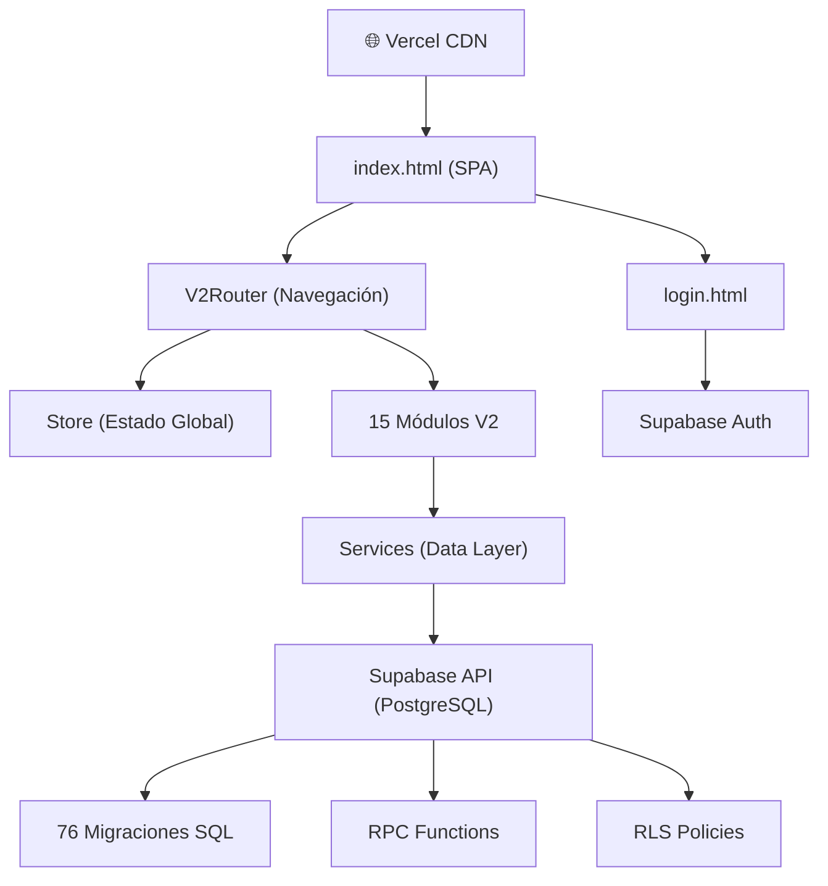
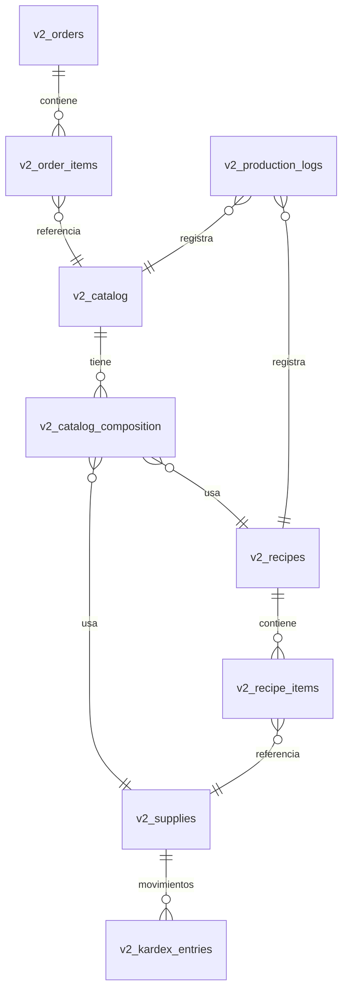

# Reporte de Factibilidad: Focaccia Plus and Coffee V2

**Fecha:** 1 de Marzo de 2026  
**Autor:** Antigravity AI  
**Versión del Sistema:** V2.3-surgical  
**Estado General:** ✅ Operativo y en producción

---

## 1. Resumen Ejecutivo

Focaccia Plus and Coffee V2 es un sistema ERP artesanal diseñado a medida para la gestión integral de una panadería artesanal. El sistema cubre **desde la compra de materia prima hasta el cierre de caja diario**, pasando por la formulación de recetas con precisión panadera, punto de venta, producción con control de mermas, preventa, tesorería y liquidaciones entre socios.

> [!IMPORTANT]
> El sistema es **100% funcional y desplegado en producción** a través de Vercel, con backend en Supabase (PostgreSQL). No es un prototipo; es una herramienta operativa activa.

---

## 2. Arquitectura Técnica

### 2.1 Stack Tecnológico

| Capa | Tecnología | Estado |
|------|-----------|--------|
| **Frontend** | Vanilla JS (ES Modules) + CSS personalizado | ✅ Estable |
| **Build** | Vite 7.3 | ✅ Configurado |
| **Backend (BaaS)** | Supabase (PostgreSQL + Auth + Storage + RPC) | ✅ Activo |
| **Hosting** | Vercel (CI/CD automático desde GitHub) | ✅ Desplegado |
| **Autenticación** | Supabase Auth (email/password) | ✅ Con roles |
| **Exportación** | jsPDF + jsPDF-AutoTable + SheetJS (CDN) | ✅ Funcional |

### 2.2 Diagrama de Arquitectura

### 2.3 Patrón de Diseño por Módulo

Cada uno de los 15 módulos sigue una arquitectura de 3 capas consistente:

| Archivo | Responsabilidad |
|---------|----------------|
| `module.view.js` | Template HTML + CSS inline (Template Literals) |
| `module.controller.js` | Orquestación de eventos, estado local y lógica de negocio |
| `module.service.js` | Capa de acceso a datos (Supabase queries, RPCs) |

---

## 3. Módulos del Sistema (15 Total)

### Módulos Operativos Principales

| # | Módulo | Descripción | Estado |
|---|--------|-------------|--------|
| 1 | **Dashboard** | KPIs en tiempo real: ventas del día, alertas de stock, gráficos | ✅ Completo |
| 2 | **Punto de Venta (POS)** | Venta directa en mostrador con carrito, pagos mixtos (USD/Bs) | ✅ Completo |
| 3 | **Catálogo** | Archivo maestro de productos con escandallo (BOM) y márgenes | ✅ Completo |
| 4 | **Recetas** | Fórmula panadera (% relativo al ingrediente ancla) con sub-recetas | ✅ Completo |
| 5 | **Suministros** | Inventario de materia prima con alertas de stock mínimo | ✅ Completo |
| 6 | **Producción** | Registro de horneado con escalado quirúrgico y control de mermas | ✅ Completo |
| 7 | **Preventa** | Gestión de pedidos anticipados, lista de mercado y órdenes | ✅ Completo |

### Módulos Financieros

| # | Módulo | Descripción | Estado |
|---|--------|-------------|--------|
| 8 | **Tesorería** | Gastos operativos y aportes de capital por socio | ✅ Completo |
| 9 | **Liquidaciones** | Cálculo de utilidades netas y distribución entre socios | ✅ Completo |
| 10 | **Compras** | Registro de compras de materia prima con actualización de costos | ✅ Completo |
| 11 | **Cuentas por Cobrar** | Seguimiento de pagos pendientes de clientes | ✅ Completo |

### Módulos de Soporte

| # | Módulo | Descripción | Estado |
|---|--------|-------------|--------|
| 12 | **Clientes** | Base de datos de clientes con historial | ✅ Completo |
| 13 | **Kardex** | Bitácora de movimientos de inventario | ✅ Completo |
| 14 | **Reportes** | Generación de informes y análisis | ✅ Completo |
| 15 | **Configuración** | Tasas de cambio (BCV), parámetros del sistema | ✅ Completo |

---

## 4. Seguridad y Control de Acceso

### 4.1 Autenticación
- Login con email/password vía **Supabase Auth**.
- Sesión persistente con tokens JWT.
- Redirección automática a `/login.html` si no hay sesión activa.

### 4.2 Roles de Usuario

| Rol | Permisos |
|-----|----------|
| **Director** | Acceso total (incluyendo liquidaciones, configuración y eliminación de datos) |
| **Gerente** | Operaciones completas excepto configuración avanzada |
| **Asistente** | Operaciones básicas (venta, registro de producción) |

### 4.3 Seguridad de Base de Datos
- **Row Level Security (RLS)** implementada en todas las tablas críticas (23 políticas en migración #23).
- Las claves sensibles se manejan a nivel de Supabase con `anon` key (solo lectura pública controlada por RLS).

> [!WARNING]
> La `anon key` de Supabase está expuesta en el código fuente del frontend. Esto es **por diseño** de Supabase y es seguro **siempre y cuando las políticas RLS estén correctamente configuradas**. Sin embargo, se recomienda auditar periódicamente las policies.

---

## 5. Base de Datos

### 5.1 Evolución del Schema
El sistema cuenta con **76 archivos de migración SQL**, lo cual demuestra una evolución orgánica y continua del modelo de datos. Las migraciones cubren:

- Estructura core (tablas, relaciones, UUIDs)
- Lógica transaccional (RPCs para checkout atómico, producción quirúrgica)
- Triggers para actualización automática de stock
- Vistas materializadas para reportes financieros
- Políticas RLS por rol de usuario

### 5.2 Tablas Principales

### 5.3 RPCs Críticas
- `v2_rpc_registrar_produccion_quirurgica`: Registro atómico de producción con descuento de inventario.
- `v2_rpc_atomic_checkout`: Checkout atómico del POS con creación de orden y descuento de stock.
- `v2_rpc_calculate_recipe_cost`: Cálculo recursivo de costos incluyendo sub-recetas.

---

## 6. Análisis de Fortalezas

| Área | Fortaleza |
|------|-----------|
| **Diseño a medida** | El sistema está hecho *exactamente* para las necesidades de una panadería artesanal venezolana (doble moneda, fórmula panadera, preventa) |
| **Sin dependencias pesadas** | Vanilla JS sin frameworks = carga ultrarrápida, sin vulnerabilidades de dependencias complejas |
| **Backend serverless** | Supabase elimina la necesidad de mantener servidores propios |
| **Despliegue automático** | Push a GitHub → Vercel despliega automáticamente en producción |
| **Escalado de recetas** | El motor de fórmula panadera con escalado quirúrgico es una ventaja competitiva clave |
| **Responsive** | Optimizado para funcionar en PC, tablet y celular |
| **Exportación** | PDF y Excel disponibles en módulos críticos |

---

## 7. Análisis de Riesgos y Áreas de Mejora

### 7.1 Riesgos Técnicos

| Riesgo | Severidad | Mitigación Sugerida |
|--------|-----------|---------------------|
| **76 migraciones sin versionamiento formal** | 🟡 Media | Consolidar en un schema base limpio + migraciones incrementales numeradas |
| **CSS inline en Views** | 🟡 Media | Migrar estilos a archivos `.css` separados para mejor mantenibilidad |
| **Sin tests automatizados** | 🟠 Alta | Implementar tests unitarios para services y tests E2E para flujos críticos (POS, Producción) |
| **Manejo de errores inconsistente** | 🟡 Media | Estandarizar un `ErrorHandler` global con notificaciones toast en vez de `alert()` |
| **Sin backup automatizado** | 🟠 Alta | Configurar backups automáticos de Supabase (disponible en plan Pro) |

### 7.2 Riesgos de Negocio

| Riesgo | Severidad | Mitigación |
|--------|-----------|------------|
| **Dependencia de Supabase** | 🟡 Media | El código SQL es portable a cualquier PostgreSQL. Migración posible sin reescritura |
| **Dependencia de Vercel** | 🟢 Baja | Es un sitio estático, desplegable en cualquier hosting (Netlify, Cloudflare Pages, etc.) |
| **Un solo desarrollador técnico** | 🟠 Alta | Documentar arquitectura y crear guías de mantenimiento |

---

## 8. Métricas del Proyecto

| Métrica | Valor |
|---------|-------|
| Líneas de código frontend (estimado) | ~12,000+ |
| Módulos funcionales | 15 |
| Archivos de services | 15 |
| Migraciones SQL | 76 |
| Dependencias npm (producción) | 3 (Supabase, jsPDF, AutoTable) |
| Dependencias npm (desarrollo) | 1 (Vite) |
| Tiempo de carga inicial (estimado) | < 2 segundos |
| Hosting mensual | $0 (Vercel Free + Supabase Free Tier) |

---

## 9. Factibilidad por Dimensión

### 9.1 Factibilidad Técnica: ✅ ALTA
El sistema está construido sobre tecnologías probadas y modernas. La arquitectura es simple, predecible y mantenible. No existe deuda técnica crítica que impida la operación.

### 9.2 Factibilidad Operativa: ✅ ALTA
El sistema ya está **en producción activa**, siendo utilizado para gestionar operaciones reales de la panadería. Los 15 módulos cubren el ciclo completo del negocio.

### 9.3 Factibilidad Económica: ✅ MUY ALTA
- **Costo de infraestructura: $0/mes** (Free tiers de Vercel y Supabase).
- Sin licencias de software.
- Sin servidores que mantener.
- El único costo es el desarrollo, que se amortiza con el tiempo.

### 9.4 Factibilidad de Escalabilidad: 🟡 MODERADA
- **Escala vertical (más datos):** Supabase Free soporta hasta 500MB de DB y 1GB de storage. Para más, el plan Pro cuesta ~$25/mes.
- **Escala horizontal (más usuarios):** El sistema actual no tiene limitaciones para ~5-10 usuarios simultáneos. Para más, se necesitaría optimizar queries y considerar caching.
- **Escala funcional (más módulos):** La arquitectura modular permite agregar nuevos módulos sin afectar los existentes.

---

## 10. Recomendaciones Prioritarias

| Prioridad | Recomendación | Impacto |
|-----------|--------------|---------|
| 🔴 Alta | Implementar backups automáticos de la base de datos | Protección contra pérdida de datos |
| 🔴 Alta | Agregar manejo de errores global (toast notifications en vez de alerts) | Experiencia de usuario profesional |
| 🟡 Media | Consolidar las 76 migraciones en un schema base limpio | Mantenibilidad a largo plazo |
| 🟡 Media | Añadir tests automatizados para flujos críticos | Confiabilidad en actualizaciones |
| 🟢 Baja | Migrar estilos inline a archivos CSS dedicados | Código más limpio y reutilizable |
| 🟢 Baja | Crear documentación técnica para onboarding de nuevos desarrolladores | Continuidad del proyecto |

---

## 11. Conclusión

**Focaccia Plus and Coffee V2 es un sistema ERP artesanal completamente viable, funcional y desplegado en producción.** Su arquitectura simple pero efectiva, combinada con un backend serverless de costo cero, lo convierte en una solución económicamente sostenible para el negocio.

Las áreas de mejora identificadas son de naturaleza evolutiva (no crítica), y el sistema puede continuar operando y creciendo de manera segura. Las próximas prioridades de desarrollo (costos dinámicos en producción, descuento automático de empaques) pueden implementarse incrementalmente sin riesgo para las funcionalidades existentes.

> [!TIP]
> **Veredicto Final:** El sistema es **FACTIBLE** en todas las dimensiones evaluadas. Se recomienda continuar con el desarrollo incremental, priorizando los backups y el manejo de errores como mejoras inmediatas.
